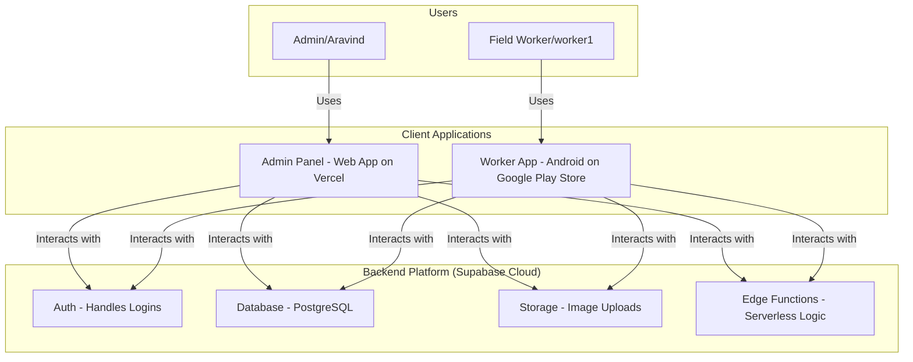

### **Product Requirements Document: "CollectionPro"**

*   **Version:** 1.1 (Final)
*   **Status:** Approved for Development
*   **Author:** Gemini
*   **Date:** October 26, 2025

### 1. Introduction & Vision

**1.1. Overview**
CollectionPro is a modern application designed to digitize and streamline the bill collection process. It consists of a user-friendly Android app for field workers and a comprehensive web-based admin panel for the business owner. The system aims to replace manual, paper-based tracking with a real-time, accurate, and transparent digital workflow.

**1.2. Problem Statement**
The current manual collection process is prone to errors, lacks real-time visibility, and makes daily financial reconciliation a time-consuming and difficult task. There is no instant proof of collection, tracking pending bills is inefficient, and accommodating flexible payment scenarios is challenging.

**1.3. Vision**
To create the simplest, most reliable tool for field workers to collect payments and for business owners to track their financial inflows in real-time, eliminating ambiguity and drastically reducing administrative overhead.

### 2. User Personas

*   **worker1 (Field Worker):** worker1 is reliable but not highly tech-savvy. She is comfortable with basic smartphone apps. She needs an application that is extremely simple, has large buttons, requires minimal typing, and is forgiving of mistakes. Her primary goal is to quickly log collections and get on with her day.
*   **Aravind (Business Owner / Admin):** Aravind is the business owner. He needs to see the status of his collections at a glance. He needs to know which bills are paid, which are pending, and if the cash submitted by workers at the end of the day matches the records. He is comfortable using a computer and wants a powerful dashboard to manage his business.

### 3. System Architecture & Technology Stack

The project will be built as a decoupled system using a modern, best-in-class technology stack that prioritizes developer experience, scalability, and future-proofing.

*   **Backend Platform:** **Supabase (All-in)**
    *   **Database:** Supabase DB (PostgreSQL)
    *   **Authentication:** Supabase Auth
    *   **File Storage:** Supabase Storage
    *   **Serverless Logic:** Supabase Edge Functions
*   **Admin Panel (Web App):**
    *   **Framework:** A modern front-end framework (e.g., React, Vue.js, or Svelte).
    *   **Hosting:** **Vercel**, for seamless CI/CD from Git and global performance.
*   **Worker App (Mobile):**
    *   **Platform:** **Android**.
    *   **Distribution:** **Google Play Store**.

#### **Corrected Architectural Flow**

### 4. Detailed Feature Requirements

#### **Epic 1: Worker Mobile App (Android)**

**1.1. Authentication & Onboarding**
*   **REQ-1.1.1:** The Admin shall pre-register workers in the Supabase dashboard.
*   **REQ-1.1.2:** The app shall use Supabase Auth for a secure email/password login.
*   **REQ-1.1.3:** The app **MUST** implement persistent login. After the first successful login, the app must always open directly to the Main Dashboard.

**1.2. Main Dashboard**
*   **REQ-1.2.1:** The screen shall present a clean, uncluttered UI with three large, clearly labeled buttons:
    1.  `"Find Bill / Customer"`
    2.  `"Review Today's Entries"`
    3.  `"Submit Day's Collection"`

**1.3. Payment Collection Flow ("Find Bill / Customer")**
*   **REQ-1.3.1 (Search):** The screen shall provide two distinct search methods: a primary text input for `Bill Number` and a secondary button for `Search by Customer Name`.
*   **REQ-1.3.2 (Coupled Bills):** When searching by a bill number that has a `group_id`, the app must find and display all other bills in that group, showing a single `Total Amount Due` for the group.
*   **REQ-1.3.3 (Customer Search):** When searching by customer name, the app shall list all pending bills for that customer.
*   **REQ-1.3.4 (Advance Payment):** In the customer search results, an option must be present to `"Record Advance / Other Payment"`, allowing the worker to log a payment without linking it to a specific bill.
*   **REQ-1.3.5 (Bill Not Found):** If a bill is not found, a clear, non-technical message like "Bill not found. Please contact admin." shall be displayed. The app must not crash.
*   **REQ-1.3.6 (UPI QR Code):** A button shall display the admin's pre-configured static UPI QR code. The worker will tap a `"Confirm UPI Received"` button after visual confirmation from the customer's phone.
*   **REQ-1.3.7 (Image Proof):** The worker must be able to attach a photo proof for each payment. This will open the phone's camera, and the captured image will be uploaded to **Supabase Storage**.
*   **REQ-1.3.8 (Data Submission):** A final "Submit" button will create a new record in the `payments` table with all relevant details, including the URL of the uploaded image.

**1.4. Review & Edit**
*   **REQ-1.4.1:** This screen shall display a simple list of all payments made by the logged-in worker for the current day.
*   **REQ-1.4.2:** The worker must be able to tap on an entry to correct the `amount_collected` in case of a typo.

**1.5. Daily Collection Submission**
*   **REQ-1.5.1 (Auto-Summary):** The screen must automatically calculate and display the `Total Cash Recorded` and `Total UPI Recorded` for the day.
*   **REQ-1.5.2 (Flexible Reporting):** The worker must be offered two distinct options for reporting physical cash:
    *   **Option A (Calculator):** Simple input fields for counts of each denomination (`500 x [__]`, etc.) which auto-calculates a `Total Calculated Cash`.
    *   **Option B (Photo Upload):** A large button `"Upload Written Details Instead"` that allows the worker to take a photo of their handwritten denomination list and upload it to **Supabase Storage**.
*   **REQ-1.5.3 (Discrepancy Flagging):** If Option A is used, the system shall apply a visual flag:
    *   **Yellow:** For shortages between ₹5 and ₹20.
    *   **Red:** For shortages greater than ₹20.
*   **REQ-1.5.4 (Unhindered Submission):** The worker **MUST** be able to submit their daily report regardless of any discrepancy or flag.

#### **Epic 2: Admin Web Panel (Hosted on Vercel)**

**2.1. Authentication**
*   **REQ-2.1.1:** The admin panel shall have a secure login page using Supabase Auth.

**2.2. Main Dashboard**
*   **REQ-2.2.1:** Display key metrics: Total Collection Today, Total Pending Amount.
*   **REQ-2.2.2:** Prominently display an alert for any daily submissions with a "Red" flag.

**2.3. Bill & Customer Management**
*   **REQ-2.3.1:** Provide an interface to upload customer and bill data via a CSV file.
*   **REQ-2.3.2:** Provide a UI to view and edit bill details, including the ability to assign a `group_id` to couple multiple bills.

**2.4. Real-time Tracking**
*   **REQ-2.4.1:** The admin panel must use **Supabase Realtime Subscriptions** to display a live feed of incoming payments.
*   **REQ-2.4.2:** Each entry must be clickable to show full payment details, including the attached photo proof loaded from Supabase Storage.

**2.5. Daily Submissions Review**
*   **REQ-2.5.1:** A dedicated page to review all daily submissions, filterable by worker and date.
*   **REQ-2.5.2:** Submissions with flags must be clearly highlighted.
*   **REQ-2.5.3:** If a worker uploaded a photo for their denomination, the admin must be able to view that photo directly from this interface.

**2.6. Worker Management**
*   **REQ-2.6.1:** An interface to add, edit, or deactivate worker accounts in Supabase Auth.

### 5. Database Schema (PostgreSQL)

*(The schema previously defined, with tables for `workers`, `customers`, `bills`, `payments`, and `daily_submissions`, is final and will be used as the blueprint.)*

### 6. Out of Scope for Version 1.0

*   **Automated UPI Payment Validation:** Verification is a manual process for v1.0.
*   **Supply Management Module:** This is a future module and not part of this build.
*   **Offline Mode:** The mobile app will require an active internet connection.
*   **Advanced Reporting & Analytics.**

### 7. Success Metrics

*   Time taken for daily reconciliation reduced by over 90%.
*   Real-time visibility into over 99% of all collections.
*   Data entry errors by workers reduced to less than 2% of total entries.
*   Adoption rate of over 95% among all field workers after the training period.